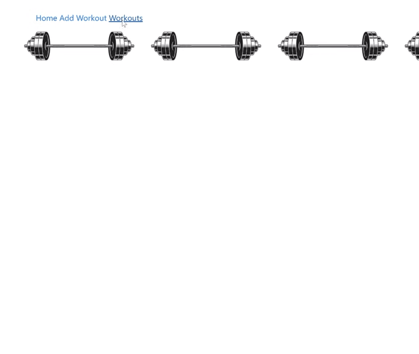

A web application that stores user-submitted workout and exercise data. Allows the user to update or delete their data. 


## Features
  - Uses Redux Thunk Middleware to send and recieve data from an API 
  - Renders JavaScript and HTML (JSX) onto the DOM via React components
  - Users can add and edit workouts
  
  
## Tech Used
- React.js
- Redux
- Bootstrap
- React Bootstrap
- React Router
- Styled component
- Redux Thunk Middleware


## Deploy Instructions: 
- Clone this repo to local machine ```git clone <this-repo-url>```.
- Ensure backend API is running at ```http://localhost:3001/```
- Run ```npm install``` to install dependencies.
- Run ```npm start``` to start server


This project was bootstrapped with [Create React App](https://github.com/facebook/create-react-app).


